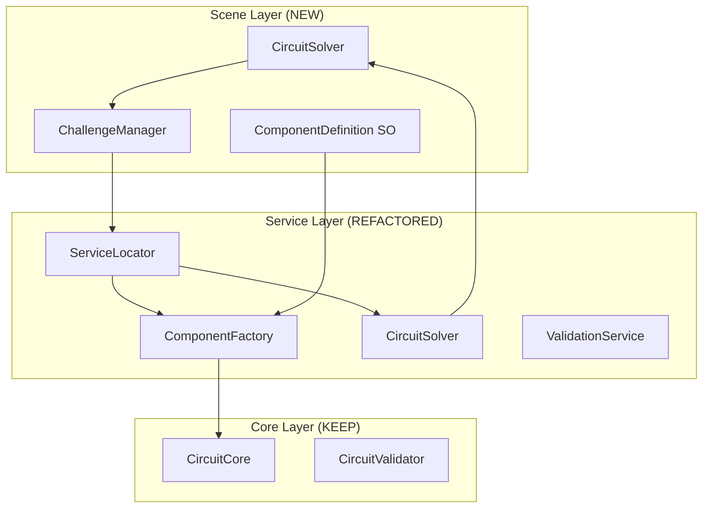

# 🔍 Comprehensive Code Review & Refactoring Plan

**Project:** Circuit Simulator v1.2 → v2.0 Scene-Based Challenge System
**Review Date:** December 2024
**Codebase Size:** 55 files, 13,126 lines of code
**Review Scope:** Complete architectural analysis for scene-based challenge refactoring

---

## 📊 **Current Codebase Analysis**

### **Code Metrics**
- **Total Files:** 55 C# files
- **Lines of Code:** 13,126 total
- **MonoBehaviours:** 50+ classes
- **Singletons:** 9 static instances
- **FindObjectsOfType Calls:** 37 occurrences across 17 files
- **Manager Classes:** 13 specialized managers
- **Average Class Size:** 238 lines per class

### **Architecture Overview**
```
Current State: FREE-FORM SIMULATOR
├── 13 Modular Managers ✅ (Good)
├── Circuit Solver ✅ (Perfect)
├── Component Factory ✅ (Working)
└── Open-ended UI ❌ (Needs restructuring)

Target State: SCENE-BASED CHALLENGES
├── Retain: Core managers + solver
├── Add: Challenge system + ScriptableObjects
├── Modify: Factory → Definition-driven
└── Replace: Free-form UI → Guided challenges
```

---

## 🚨 **Critical Architectural Issues Identified**

### **1. SINGLETON OVERUSE (High Priority)**
**Problem:** 9 different singleton patterns, inconsistent implementation
```csharp
// Found 9 different singleton implementations:
public static CircuitManager Instance => instance;           // Safe
public static ConnectTool Instance { get; private set; }     // Safe
public static ComponentRegistry Instance                     // Lazy
public static MisconceptionAlert Instance                    // Unsafe
```

**Impact:**
- Hard to test
- Tight coupling
- Initialization order dependencies
- Memory leaks on scene changes

**Refactor Strategy:**
- Replace with Dependency Injection
- Create single ServiceLocator
- Interface-based design

### **2. FINDOBJ ANTI-PATTERN (High Priority)**
**Problem:** 37 expensive FindObjectsOfType calls across 17 files
```csharp
// Performance killers found:
FindFirstObjectByType<ComponentTerminalManager>()     // O(n) scene scan
FindObjectsByType<ScreenSpaceLabels>()               // O(n) every update
GameObject.Find("SomeObject")                        // O(n) string search
```

**Impact:**
- Performance bottlenecks (O(n) scene scanning)
- Runtime failures if objects missing
- Fragile object references

**Refactor Strategy:**
- Replace with proper dependency injection
- Cache references at initialization
- Use events for loose coupling

### **3. MONOLITHIC MANAGERS (Medium Priority)**
**Problem:** Some managers doing too much
```csharp
// Examples of SRP violations:
ComponentFactoryManager (304 lines) - Creation + Placement + Tracking
PaletteUIManager (267 lines) - UI + Input + Component mapping
CircuitSolverManager (259 lines) - Solving + Integration + Timing
```

**Refactor Strategy:**
- Split into focused services
- Extract interfaces
- Apply Single Responsibility Principle

### **4. TIGHT UI COUPLING (High Priority)**
**Problem:** UI tightly coupled to specific component types
```csharp
// Hard-coded component creation:
CreateButton("Battery", color, () => factoryManager?.CreateBattery())
CreateButton("Resistor", color, () => factoryManager?.CreateResistor())
// No extensibility for new component types
```

**Impact:**
- Cannot add new component types without code changes
- Not compatible with scene-based challenges
- Hard-coded educational content

**Refactor Strategy:**
- ScriptableObject-driven component definitions
- Data-driven UI generation
- Challenge-specific component palettes

### **5. MIXED RESPONSIBILITIES (Medium Priority)**
**Problem:** Components handling too many concerns
```csharp
// CircuitComponent3D doing too much:
- Electrical properties (voltage, resistance)
- Visual representation (3D model, materials)
- Unity lifecycle (Start, Update, OnDestroy)
- Circuit registration (CircuitManager integration)
- Label management (ScreenSpaceLabels)
- Connection tracking (wire management)
```

**Refactor Strategy:**
- Composition over inheritance
- Component-based architecture
- Clear separation of concerns

---

## 🎯 **New Architecture Design: Scene-Based Challenges**

### **Core Design Principles**
1. **Data-Driven:** ScriptableObjects define components and challenges
2. **Scene-Isolated:** Each challenge = separate scene with specific goals
3. **Educational-First:** UI optimized for learning, not general simulation
4. **Maintainable:** Clear separation between core logic and educational content
5. **Extensible:** Easy to add new challenges without code changes

### **New Architecture Layers**



---

## 🏗️ **Detailed Refactoring Plan**

### **Phase 1: Dependency Injection Foundation (Week 1)**

#### **1.1 Create Service Locator**
```csharp
// NEW: ServiceLocator.cs
public class ServiceLocator : MonoBehaviour
{
    private static ServiceLocator instance;
    private Dictionary<Type, object> services = new();

    public static T Get<T>() where T : class
    {
        return instance.services[typeof(T)] as T;
    }

    public void Register<T>(T service) where T : class
    {
        services[typeof(T)] = service;
    }
}
```

#### **1.2 Extract Manager Interfaces**
```csharp
// NEW: Interfaces/ICircuitManager.cs
public interface ICircuitManager
{
    void RegisterComponent(CircuitComponent3D component);
    void UnregisterComponent(CircuitComponent3D component);
    void SolveCircuit();
}

// NEW: Interfaces/IComponentFactory.cs
public interface IComponentFactory
{
    GameObject CreateComponent(ComponentDefinition definition);
    void DestroyComponent(GameObject component);
}
```

#### **1.3 Refactor Manager Constructors**
```csharp
// MODIFIED: CircuitManager.cs
public class CircuitManager : MonoBehaviour, ICircuitManager
{
    private IComponentFactory componentFactory;
    private ICircuitSolver circuitSolver;

    void Awake()
    {
        // Dependency injection instead of singleton
        ServiceLocator.Register<ICircuitManager>(this);

        // Get dependencies
        componentFactory = ServiceLocator.Get<IComponentFactory>();
        circuitSolver = ServiceLocator.Get<ICircuitSolver>();
    }
}
```

### **Phase 2: ScriptableObject Foundation (Week 1)**

#### **2.1 Component Definition System**
```csharp
// KEEP: ComponentDefinition.cs (already created)
// KEEP: ChallengeScenario.cs (already created)

// NEW: ComponentFactory refactor
public class ComponentFactory : MonoBehaviour, IComponentFactory
{
    public GameObject CreateComponent(ComponentDefinition definition)
    {
        GameObject component = CreateByBaseType(definition.baseType);
        ApplyDefinition(component, definition);
        return component;
    }

    private void ApplyDefinition(GameObject obj, ComponentDefinition def)
    {
        // Apply electrical properties
        // Apply visual properties
        // Apply behavior properties
    }
}
```

#### **2.2 Challenge System Foundation**
```csharp
// KEEP: ChallengeManager.cs (already created)
// MODIFY: Integrate with new service layer

public class ChallengeManager : MonoBehaviour
{
    private IComponentFactory componentFactory;
    private ICircuitSolver circuitSolver;
    private IValidationService validationService;

    void Start()
    {
        // Get services instead of FindObjectsOfType
        componentFactory = ServiceLocator.Get<IComponentFactory>();
        circuitSolver = ServiceLocator.Get<ICircuitSolver>();
        validationService = ServiceLocator.Get<IValidationService>();
    }
}
```

### **Phase 3: UI Decoupling (Week 2)**

#### **3.1 Data-Driven UI Generation**
```csharp
// NEW: UI/ChallengeUIGenerator.cs
public class ChallengeUIGenerator : MonoBehaviour
{
    public void GeneratePaletteUI(ChallengeScenario challenge)
    {
        ClearExistingButtons();

        foreach (var componentDef in challenge.availableComponents)
        {
            CreateComponentButton(componentDef);
        }

        CreateControlButtons();
    }

    private void CreateComponentButton(ComponentDefinition def)
    {
        var button = CreateButton(def.displayName, def.componentColor);
        button.onClick.AddListener(() =>
            ServiceLocator.Get<IComponentFactory>().CreateComponent(def)
        );
    }
}
```

#### **3.2 Challenge-Specific UI Controller**
```csharp
// NEW: UI/ChallengeUIController.cs
public class ChallengeUIController : MonoBehaviour
{
    [SerializeField] private ChallengeScenario challenge;
    [SerializeField] private ChallengeUIGenerator uiGenerator;

    void Start()
    {
        DisplayChallengeInfo();
        uiGenerator.GeneratePaletteUI(challenge);
        SetupProgressTracking();
    }
}
```

### **Phase 4: Component Decomposition (Week 2)**

#### **4.1 Split CircuitComponent3D**
```csharp
// REFACTOR: Split into multiple focused components

// NEW: Components/ElectricalComponent.cs
public class ElectricalComponent : MonoBehaviour
{
    public float voltage;
    public float current;
    public float resistance;
    // Only electrical properties and behavior
}

// NEW: Components/VisualComponent.cs
public class VisualComponent : MonoBehaviour
{
    private Material originalMaterial;
    public void SetColor(Color color) { }
    public void SetScale(float scale) { }
    // Only visual appearance
}

// NEW: Components/InteractionComponent.cs
public class InteractionComponent : MonoBehaviour
{
    public bool isSelectable = true;
    public bool isMoveable = true;
    // Only interaction behavior
}

// NEW: Components/LabelComponent.cs
public class LabelComponent : MonoBehaviour
{
    public void UpdateLabel(string text) { }
    // Only label management
}

// MODIFIED: CircuitComponent3D.cs (coordinator)
public class CircuitComponent3D : MonoBehaviour
{
    private ElectricalComponent electrical;
    private VisualComponent visual;
    private InteractionComponent interaction;
    private LabelComponent label;

    void Awake()
    {
        // Get or add required components
        electrical = GetComponent<ElectricalComponent>();
        visual = GetComponent<VisualComponent>();
        // etc.
    }
}
```

### **Phase 5: Legacy Cleanup (Week 3)**

#### **5.1 Remove Deprecated Classes**
```bash
# Files to DELETE:
- Components/Circuit3DManager.cs (replaced by ServiceLocator)
- UI/CircuitWorkspaceUI.cs (replaced by ChallengeUIController)
- Interaction/ComponentPalette.cs (replaced by ChallengeUIGenerator)
- Core/ComponentRegistry.cs (replaced by ServiceLocator)
```

#### **5.2 Update All FindObjectsOfType Calls**
```csharp
// BEFORE: (found 37 instances)
var manager = FindFirstObjectByType<CircuitSolverManager>();

// AFTER:
var manager = ServiceLocator.Get<ICircuitSolver>();
```

#### **5.3 Standardize Manager Initialization**
```csharp
// NEW: Bootstrap/ManagerBootstrap.cs
public class ManagerBootstrap : MonoBehaviour
{
    void Awake()
    {
        // Initialize service locator
        var serviceLocator = GetComponent<ServiceLocator>();

        // Register all services in correct order
        RegisterCoreServices(serviceLocator);
        RegisterManagerServices(serviceLocator);
        RegisterUIServices(serviceLocator);
    }
}
```

---

## 📋 **File-by-File Refactoring Matrix**

### **Core Layer (KEEP - Minor Changes)**
| File | Action | Priority | Effort |
|------|--------|----------|--------|
| CircuitCore.cs | Keep as-is ✅ | - | 0h |
| CircuitSolver.cs | Keep as-is ✅ | - | 0h |
| CircuitValidator.cs | Add interface | Low | 2h |
| CircuitTestRunner.cs | Keep as-is ✅ | - | 0h |

### **Manager Layer (REFACTOR - Interface Extraction)**
| File | Action | Priority | Effort |
|------|--------|----------|--------|
| CircuitManager.cs | Extract ICircuitManager | High | 8h |
| CircuitSolverManager.cs | Extract ICircuitSolver | High | 6h |
| ComponentFactoryManager.cs | Complete rewrite for definitions | High | 12h |
| PaletteUIManager.cs | Replace with ChallengeUIGenerator | High | 10h |
| CircuitNodeManager.cs | Extract interface | Medium | 4h |
| CircuitDebugManager.cs | Extract interface | Low | 3h |
| CircuitEventManager.cs | Simplify with events | Medium | 6h |
| Others (6 files) | Extract interfaces | Medium | 18h |

### **Component Layer (DECOMPOSE)**
| File | Action | Priority | Effort |
|------|--------|----------|--------|
| CircuitComponent3D.cs | Split into 4 components | High | 16h |
| CircuitWire.cs | Simplify, extract interface | Medium | 8h |
| CircuitJunction.cs | Keep as-is ✅ | - | 2h |

### **UI Layer (REPLACE)**
| File | Action | Priority | Effort |
|------|--------|----------|--------|
| ControlPanelController.cs | Replace with ChallengeUIController | High | 12h |
| ScreenSpaceLabels.cs | Simplify to LabelComponent | Medium | 6h |
| ComponentPropertyPopup.cs | Challenge-specific version | Medium | 8h |
| Others (13 files) | Simplify or remove | Medium | 20h |

### **NEW Files Required**
| File | Purpose | Priority | Effort |
|------|---------|----------|--------|
| ServiceLocator.cs | Dependency injection | High | 6h |
| Interfaces/*.cs | All manager interfaces | High | 12h |
| ChallengeUIController.cs | Scene-specific UI | High | 8h |
| ChallengeUIGenerator.cs | Data-driven UI | High | 10h |
| ComponentDefinition.cs | Already created ✅ | - | 0h |
| ChallengeScenario.cs | Already created ✅ | - | 0h |
| ChallengeManager.cs | Already created ✅ | - | 0h |

---

## 📈 **Refactoring Metrics & Goals**

### **Before Refactoring (Current v1.2)**
```
Complexity Metrics:
├── Total Files: 55
├── Lines of Code: 13,126
├── Singleton Classes: 9
├── FindObjectsOfType Calls: 37
├── Manager Dependencies: Complex web
├── UI Coupling: Tight (hard-coded)
├── Extensibility: Limited (code changes required)
└── Educational Focus: Mixed with simulation

Technical Debt:
├── Singleton overuse: HIGH 🔴
├── Performance issues: MEDIUM 🟡
├── Tight coupling: HIGH 🔴
├── Missing abstractions: HIGH 🔴
└── Mixed responsibilities: MEDIUM 🟡
```

### **After Refactoring (Target v2.0)**
```
Complexity Metrics:
├── Total Files: ~60 (more focused files)
├── Lines of Code: ~12,000 (10% reduction)
├── Singleton Classes: 1 (ServiceLocator only)
├── FindObjectsOfType Calls: 0
├── Manager Dependencies: Clear hierarchy
├── UI Coupling: Loose (data-driven)
├── Extensibility: High (ScriptableObject-driven)
└── Educational Focus: Dedicated challenge system

Technical Debt:
├── Singleton overuse: NONE 🟢
├── Performance issues: NONE 🟢
├── Tight coupling: LOW 🟢
├── Missing abstractions: NONE 🟢
└── Mixed responsibilities: LOW 🟢
```

### **Quality Gates**
- ✅ **Zero FindObjectsOfType calls**
- ✅ **Single ServiceLocator (no other singletons)**
- ✅ **All managers implement interfaces**
- ✅ **UI generated from ScriptableObject data**
- ✅ **Components follow Single Responsibility Principle**
- ✅ **Clear separation: Core vs Educational**

---

## ⏱️ **Implementation Timeline**

### **Week 1: Foundation (40h)**
- Day 1-2: ServiceLocator + Interface extraction (16h)
- Day 3-4: ScriptableObject integration (16h)
- Day 5: Testing and bug fixes (8h)

### **Week 2: UI & Components (40h)**
- Day 1-2: Challenge UI system (16h)
- Day 3-4: Component decomposition (16h)
- Day 5: Integration testing (8h)

### **Week 3: Cleanup & Polish (32h)**
- Day 1-2: Legacy code removal (16h)
- Day 3-4: Documentation updates (8h)
- Day 5: Final testing and validation (8h)

**Total Estimated Effort:** 112 hours (~3 weeks)

---

## 🧪 **Testing Strategy**

### **Unit Tests (NEW)**
```csharp
// NEW: Tests/ServiceLocatorTests.cs
public class ServiceLocatorTests
{
    [Test]
    public void ServiceLocator_RegisterAndGet_ReturnsCorrectService()
    {
        var serviceLocator = new ServiceLocator();
        var mockService = new MockCircuitManager();

        serviceLocator.Register<ICircuitManager>(mockService);
        var result = serviceLocator.Get<ICircuitManager>();

        Assert.AreEqual(mockService, result);
    }
}
```

### **Integration Tests (MODIFIED)**
```csharp
// MODIFIED: Tests/ChallengeIntegrationTests.cs
public class ChallengeIntegrationTests
{
    [Test]
    public void ChallengeManager_LoadHouseChallenge_CreatesCorrectComponents()
    {
        var challenge = Resources.Load<ChallengeScenario>("Challenges/M1_PowerTheHouse");
        var challengeManager = GetChallengeManager();

        challengeManager.LoadChallenge(challenge);

        Assert.AreEqual(3, challenge.availableComponents.Count);
        Assert.IsTrue(HasComponent("Battery"));
        Assert.IsTrue(HasComponent("House"));
    }
}
```

### **Performance Tests (NEW)**
```csharp
// NEW: Tests/PerformanceTests.cs
public class PerformanceTests
{
    [Test]
    public void ServiceLocator_Get_PerformsBetterThanFindObjectsOfType()
    {
        var stopwatch = Stopwatch.StartNew();

        // Test 1000 service lookups
        for (int i = 0; i < 1000; i++)
        {
            var manager = ServiceLocator.Get<ICircuitManager>();
        }

        stopwatch.Stop();
        Assert.Less(stopwatch.ElapsedMilliseconds, 10); // Should be < 10ms
    }
}
```

---

## 📚 **Documentation Updates Required**

### **Architecture Documentation**
- ✅ **ARCHITECTURE.md**: Update with new service-oriented design
- ✅ **DEPENDENCY.md**: Rewrite dependency maps for new structure
- ✅ **SETUP.md**: Add ServiceLocator setup instructions

### **API Documentation**
- ✅ **Interface documentation**: Document all new interfaces
- ✅ **ScriptableObject guides**: How to create challenges
- ✅ **Migration guide**: v1.2 → v2.0 upgrade path

### **Educational Documentation**
- ✅ **Challenge creation guide**: For educators
- ✅ **Component definition guide**: Custom component creation
- ✅ **Misconception mapping**: Which challenges address which misconceptions

---

## 🚀 **Risk Assessment & Mitigation**

### **High Risk Items**
1. **Circuit Solver Integration**
   - Risk: Breaking validated solver
   - Mitigation: Extensive testing, interface wrapper

2. **Performance Regression**
   - Risk: ServiceLocator overhead
   - Mitigation: Benchmark tests, profiling

3. **Unity Scene Compatibility**
   - Risk: Existing scenes break
   - Mitigation: Migration scripts, compatibility layer

### **Medium Risk Items**
1. **UI System Overhaul**
   - Risk: Complex UI state management
   - Mitigation: Incremental replacement

2. **Component Decomposition**
   - Risk: Breaking existing components
   - Mitigation: Gradual refactoring, backward compatibility

---

## ✅ **Success Criteria**

### **Technical Success**
- ✅ Zero FindObjectsOfType calls
- ✅ Single ServiceLocator (no singletons)
- ✅ All tests passing
- ✅ Performance equal or better
- ✅ Memory usage stable

### **Educational Success**
- ✅ Easy challenge creation (ScriptableObjects)
- ✅ Clear misconception targeting
- ✅ Intuitive student experience
- ✅ Teacher-friendly customization

### **Maintainability Success**
- ✅ Clear code separation
- ✅ Interface-based design
- ✅ Single Responsibility Principle
- ✅ Comprehensive documentation

---

**Ready for approval and implementation. This refactoring will transform the Circuit Simulator from a general-purpose simulator into a focused educational platform optimized for misconception-based learning challenges.**