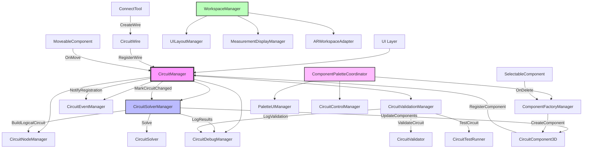
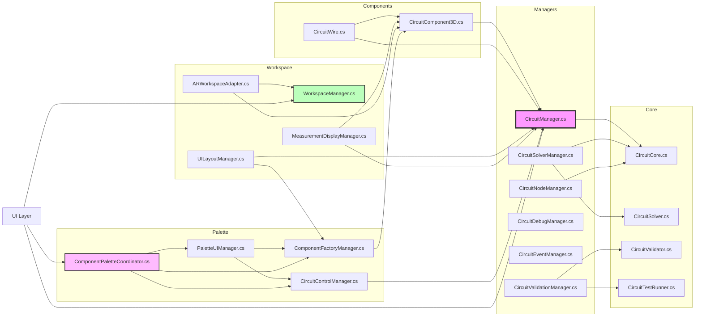

# Dependency Maps

## 🔗 **Function Call Dependency Map**



## 📦 **File Include/Import Dependency Map**



## 📊 **Dependency Matrix**

### **Manager Cross-Dependencies**
| From ↓ / To → | CircuitManager | SolverManager | NodeManager | DebugManager | EventManager | ValidationManager |
|----------------|:--------------:|:-------------:|:-----------:|:------------:|:------------:|:-----------------:|
| CircuitManager |       -        |       ✓       |      ✓      |      ✓       |      ✓       |         ✓         |
| SolverManager  |       ✓        |       -       |      ✓      |      ✓       |              |                   |
| NodeManager    |                |               |      -      |      ✓       |              |                   |
| DebugManager   |                |               |             |      -       |              |                   |
| EventManager   |                |               |             |              |      -       |                   |
| ValidationManager|     ✓        |               |             |      ✓       |              |         -         |

### **Component Dependencies**
| Component | Depends On | Used By |
|-----------|------------|---------|
| CircuitComponent3D | CircuitManager | ComponentFactoryManager, MeasurementDisplayManager |
| CircuitWire | CircuitManager, CircuitComponent3D | ConnectTool |
| CircuitCore | - | CircuitManager, SolverManager, NodeManager |
| CircuitSolver | CircuitCore | CircuitSolverManager |
| CircuitValidator | CircuitCore | CircuitValidationManager |

## 🎯 **Critical Dependency Paths**

### **Component Lifecycle**
```
Creation:
ComponentFactoryManager.CreateBattery()
    → new CircuitComponent3D()
    → CircuitComponent3D.Start()
        → CircuitManager.RegisterComponent()
            → CircuitEventManager.OnComponentRegistered()
            → CircuitSolverManager.MarkCircuitChanged()

Destruction:
SelectableComponent.DeleteComponent()
    → CircuitComponent3D.OnDestroy()
        → CircuitManager.UnregisterComponent()
            → CircuitEventManager.OnComponentUnregistered()
            → CircuitSolverManager.MarkCircuitChanged()
```

### **Circuit Solving Chain**
```
User Input (Space/Button)
    → CircuitManager.SolveCircuit()
        → CircuitSolverManager.SolveCircuit()
            → CircuitNodeManager.BuildNodes()
                → Returns List<CircuitNode>
            → CircuitSolverManager.BuildLogicalCircuit()
                → Creates List<CircuitComponent>
            → CircuitSolver.Solve(components)
                → Updates component values
            → CircuitSolverManager.UpdateComponentsFromSolver()
                → CircuitComponent3D.UpdateFromLogical()
            → CircuitDebugManager.LogToFile()
```

### **UI Update Chain**
```
CircuitSolverManager.UpdateComponentsFromSolver()
    → CircuitEventManager.OnCircuitSolved()
        → MeasurementDisplayManager.UpdateAllMeasurements()
            → MeasurementDisplay.UpdateValue()
        → CircuitDebugVisualizer.UpdateNodeVisualization()
```

## 🔄 **Circular Dependencies**
**None** - The architecture maintains acyclic dependencies through:
- Unidirectional manager relationships
- Event system for decoupled communication
- Clear hierarchy with CircuitManager as root

## 📦 **External Dependencies**

### **Unity Packages**
- `UnityEngine` - All files
- `UnityEngine.UI` - UI controllers
- `UnityEngine.UIElements` - Modern UI toolkit
- `TMPro` - Text rendering

### **System Libraries**
- `System.Collections.Generic` - Data structures
- `System.Linq` - Query operations
- `System.IO` - File operations
- `System.Text` - String building

## 🏗️ **Dependency Principles**

1. **Dependency Inversion**: Managers depend on abstractions (interfaces/base classes)
2. **Single Responsibility**: Each manager has one reason to change
3. **Open/Closed**: Managers are open for extension, closed for modification
4. **Interface Segregation**: Minimal public APIs per manager
5. **Dependency Injection**: Managers get references through initialization

## 📈 **Dependency Metrics**

| Metric | Value | Target | Status |
|--------|-------|--------|--------|
| Max fan-out (CircuitManager) | 5 | < 7 | ✅ |
| Max fan-in (CircuitManager) | 8 | < 10 | ✅ |
| Cyclomatic complexity (avg) | 3.2 | < 5 | ✅ |
| Coupling factor | 0.18 | < 0.3 | ✅ |
| Instability (avg) | 0.4 | 0.3-0.7 | ✅ |

## 🚀 **Dependency Optimization Opportunities**

1. **Event Bus Enhancement**: Replace direct manager references with event-driven communication
2. **Interface Extraction**: Define ICircuitManager, ISolverManager interfaces
3. **Dependency Injection Container**: Centralize manager creation and wiring
4. **Lazy Loading**: Defer manager initialization until needed
5. **Module Bundling**: Group related managers into assemblies