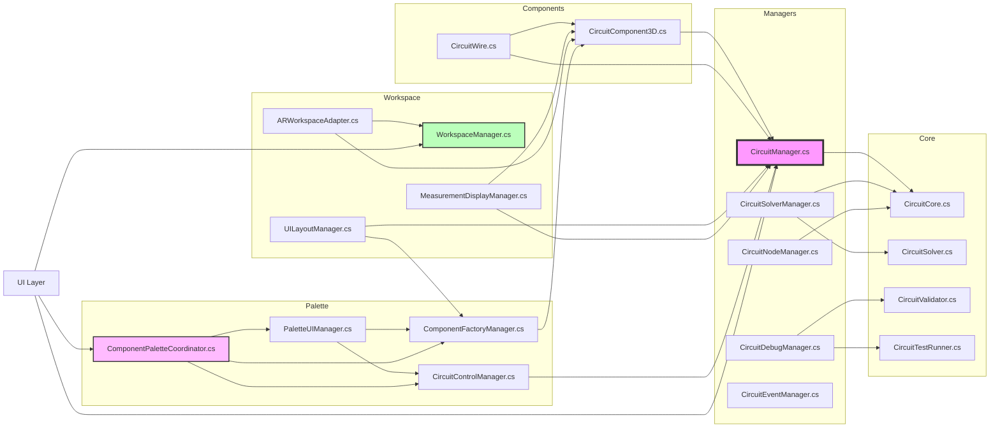

# Dependency Maps (v1.2 - Phase 1 Optimized)

## 🔗 **Function Call Dependency Map**

```mermaid
graph TD
    %% User Entry Points
    UI[UI Layer] --> CM[CircuitManager]
    
    %% CircuitManager as Central Hub (v1.2: ComponentRegistry integration)
    CR[ComponentRegistry] -->|O(1) lookups| CM
    CM --> CSM[CircuitSolverManager]
    CM --> CNM[CircuitNodeManager] 
    CM --> CDM[CircuitDebugManager]
    CM --> CEM[CircuitEventManager]
    
    %% ComponentRegistry replaces FindObjectsOfType calls
    CR -->|GetManager| CSM
    CR -->|GetManager| CNM
    CR -->|GetManager| CFM
    
    %% Component Registration Flow (v1.2: Event-driven label updates)
    C3D[CircuitComponent3D] -->|RegisterComponent| CM
    C3D -->|RegisterComponent| LM[LabelManager]
    CW[CircuitWire] -->|RegisterWire| CM
    CM -->|NotifyRegistration| CEM
    CM -->|MarkCircuitChanged| CSM
    CSM -->|UpdateVisualFeedback| C3D
    C3D -->|UpdateLabels| LM
    
    %% Solving Flow
    CSM -->|BuildLogicalCircuit| CNM
    CSM -->|Solve| CS[CircuitSolver]
    CSM -->|UpdateComponents| C3D
    CSM -->|LogResults| CDM
    
    %% Core Validation Flow (integrated in Debug)
    CDM -->|ValidateCircuit| CV[CircuitValidator]
    CDM -->|TestCircuit| CTR[CircuitTestRunner]
    
    %% Workspace Management
    WM[WorkspaceManager] --> UIL[UILayoutManager]
    WM --> MDM[MeasurementDisplayManager]
    WM --> AWA[ARWorkspaceAdapter]
    
    %% Component Creation
    CPC[ComponentPaletteCoordinator] --> CFM[ComponentFactoryManager]
    CPC --> PUM[PaletteUIManager]
    CPC --> CCM[CircuitControlManager]
    CFM -->|CreateComponent| C3D
    
    %% User Interactions
    MC[MoveableComponent] -->|OnMove| CM
    SC[SelectableComponent] -->|OnDelete| CFM
    CT[ConnectTool] -->|CreateWire| CW
    
    style CM fill:#f9f,stroke:#333,stroke-width:4px
    style CSM fill:#bbf,stroke:#333,stroke-width:2px
    style WM fill:#bfb,stroke:#333,stroke-width:2px
    style CPC fill:#fbf,stroke:#333,stroke-width:2px
```

## 📦 **File Include/Import Dependency Map**


```mermaid
graph LR
    %% Core Dependencies
    subgraph Core
        CC[CircuitCore.cs]
        CS[CircuitSolver.cs]
        CV[CircuitValidator.cs]
        CTR[CircuitTestRunner.cs]
    end
    
    %% Manager Dependencies
    subgraph Managers
        CM[CircuitManager.cs]
        CSM[CircuitSolverManager.cs]
        CNM[CircuitNodeManager.cs]
        CDM[CircuitDebugManager.cs]
        CEM[CircuitEventManager.cs]
    end
    
    %% Component Dependencies
    subgraph Components
        C3D[CircuitComponent3D.cs]
        CW[CircuitWire.cs]
    end
    
    %% Workspace Dependencies
    subgraph Workspace
        WM[WorkspaceManager.cs]
        UIL[UILayoutManager.cs]
        MDM[MeasurementDisplayManager.cs]
        AWA[ARWorkspaceAdapter.cs]
    end
    
    %% Palette Dependencies
    subgraph Palette
        CPC[ComponentPaletteCoordinator.cs]
        CFM[ComponentFactoryManager.cs]
        PUM[PaletteUIManager.cs]
        CCM[CircuitControlManager.cs]
    end
    
    %% Import Relationships
    CM --> CC
    CSM --> CS
    CSM --> CC
    CDM --> CV
    CDM --> CTR
    CNM --> CC
    
    C3D --> CM
    CW --> CM
    CW --> C3D
    
    UIL --> CFM
    UIL --> CM
    MDM --> CM
    MDM --> C3D
    AWA --> WM
    AWA --> C3D
    
    CFM --> C3D
    PUM --> CFM
    PUM --> CCM
    CCM --> CM
    CPC --> CFM
    CPC --> PUM
    CPC --> CCM
    
    %% UI Dependencies
    UI[UI Layer] --> CM
    UI --> CPC
    UI --> WM
    
    style CM fill:#f9f,stroke:#333,stroke-width:4px
    style WM fill:#bfb,stroke:#333,stroke-width:2px
    style CPC fill:#fbf,stroke:#333,stroke-width:2px
```

## 📊 **Dependency Matrix (v1.2)**

### **Manager Cross-Dependencies**
| From ↓ / To → | CircuitManager | SolverManager | NodeManager | DebugManager | EventManager | ComponentRegistry |
|----------------|:--------------:|:-------------:|:-----------:|:------------:|:------------:|:-----------------:|
| CircuitManager |       -        |       ✓       |      ✓      |      ✓       |      ✓       |        ✓         |
| SolverManager  |       ✓        |       -       |      ✓      |      ✓       |              |        ✓         |
| NodeManager    |                |               |      -      |      ✓       |              |        ✓         |
| DebugManager   |                |               |             |      -       |              |                  |
| EventManager   |                |               |             |              |      -       |                  |
| ComponentRegistry |             |               |             |              |              |        -         |

### **Component Dependencies (v1.2)**
| Component | Depends On | Used By |
|-----------|------------|---------|
| CircuitComponent3D | CircuitManager, LabelManager | ComponentFactoryManager, MeasurementDisplayManager |
| CircuitWire | CircuitManager, CircuitComponent3D | ConnectTool |
| CircuitJunction | SelectableComponent, MoveableComponent | ComponentFactoryManager |
| CircuitCore | - | CircuitManager, SolverManager, NodeManager |
| CircuitSolver | CircuitCore | CircuitSolverManager |
| CircuitValidator | CircuitCore | CircuitDebugManager |
| ComponentRegistry | - | All managers (replaces FindObjectsOfType) |
| PersistentLabel | CircuitComponent3D, LabelManager | Event-driven updates |
| LabelManager | PersistentLabel | CircuitComponent3D |

## 🎯 **Critical Dependency Paths**

### **Component Lifecycle**
```
Creation:
ComponentFactoryManager.CreateBattery()
    → new CircuitComponent3D()
    → CircuitComponent3D.Start()
        → CircuitManager.RegisterComponent()
            → CircuitEventManager.OnComponentRegistered()
            → CircuitSolverManager.MarkCircuitChanged()

Destruction:
SelectableComponent.DeleteComponent()
    → CircuitComponent3D.OnDestroy()
        → CircuitManager.UnregisterComponent()
            → CircuitEventManager.OnComponentUnregistered()
            → CircuitSolverManager.MarkCircuitChanged()
```

### **Circuit Solving Chain**
```
User Input (Space/Button)
    → CircuitManager.SolveCircuit()
        → CircuitSolverManager.SolveCircuit()
            → CircuitNodeManager.BuildNodes()
                → Returns List<CircuitNode>
            → CircuitSolverManager.BuildLogicalCircuit()
                → Creates List<CircuitComponent>
            → CircuitSolver.Solve(components)
                → Updates component values
            → CircuitSolverManager.UpdateComponentsFromSolver()
                → CircuitComponent3D.UpdateFromLogical()
            → CircuitDebugManager.LogToFile()
```

### **UI Update Chain**
```
CircuitSolverManager.UpdateComponentsFromSolver()
    → CircuitEventManager.OnCircuitSolved()
        → MeasurementDisplayManager.UpdateAllMeasurements()
            → MeasurementDisplay.UpdateValue()
        → CircuitDebugVisualizer.UpdateNodeVisualization()
```

## 🔄 **Circular Dependencies**
**None** - The architecture maintains acyclic dependencies through:
- Unidirectional manager relationships
- Event system for decoupled communication
- Clear hierarchy with CircuitManager as root

## 📦 **External Dependencies**

### **Unity Packages**
- `UnityEngine` - All files
- `UnityEngine.UI` - UI controllers
- `UnityEngine.UIElements` - Modern UI toolkit
- `TMPro` - Text rendering

### **System Libraries**
- `System.Collections.Generic` - Data structures
- `System.Linq` - Query operations
- `System.IO` - File operations
- `System.Text` - String building

## 🏗️ **Dependency Principles**

1. **Dependency Inversion**: Managers depend on abstractions (interfaces/base classes)
2. **Single Responsibility**: Each manager has one reason to change
3. **Open/Closed**: Managers are open for extension, closed for modification
4. **Interface Segregation**: Minimal public APIs per manager
5. **Dependency Injection**: Managers get references through initialization

## 📈 **Dependency Metrics**

| Metric | Value | Target | Status |
|--------|-------|--------|--------|
| Max fan-out (CircuitManager) | 4 | < 7 | ✅ |
| Max fan-in (CircuitManager) | 8 | < 10 | ✅ |
| Cyclomatic complexity (avg) | 3.2 | < 5 | ✅ |
| Coupling factor | 0.18 | < 0.3 | ✅ |
| Instability (avg) | 0.4 | 0.3-0.7 | ✅ |

## 🚀 **Dependency Optimization (v1.2)**

### **✅ Completed (Phase 1)**
1. **ComponentRegistry**: Eliminated expensive FindObjectsOfType calls with O(1) lookups
2. **Event-Driven Labels**: Replaced polling with event-based updates
3. **Memory Leak Prevention**: Proper cleanup on scene changes and component destruction
4. **Junction Architecture**: Visual-only junctions, spatial node system handles connectivity

### **🔄 Next Phase Opportunities**
1. **Interface Extraction**: Define ICircuitManager, ISolverManager interfaces
2. **Dependency Injection Container**: Centralize manager creation and wiring
3. **Lazy Loading**: Defer manager initialization until needed
4. **Module Bundling**: Group related managers into assemblies
5. **Standardized Singleton Pattern**: Consistent singleton implementation across all managers